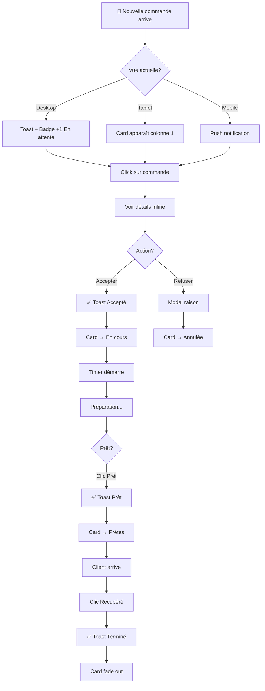
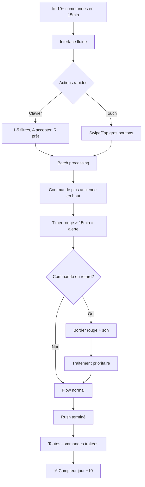
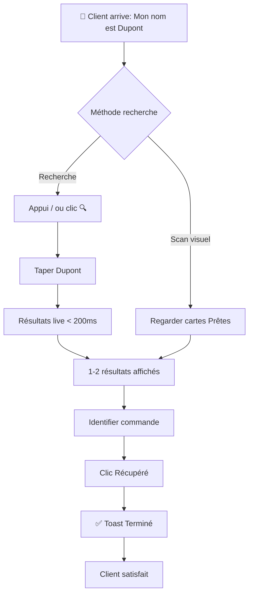

# UX Design Specification - OneEats Restaurant Dashboard

**Auteur:** Akin_
**Date:** 2026-01-16
**Focus:** Refonte complète UX/UI du Dashboard Restaurant
**Appareils cibles:** PC bureau, ordinateur portable, tablette, smartphone

---

## 1. Executive Summary

### 1.1 Vision du Projet

Créer un dashboard restaurant **unifié, efficace et cohérent** avec l'identité visuelle OneEats, optimisé pour une utilisation intensive en environnement restaurant (cuisine, comptoir, bureau).

### 1.2 Utilisateurs Cibles

| Utilisateur | Contexte | Besoins Prioritaires |
|-------------|----------|----------------------|
| **Restaurateur/Gérant** | Bureau, gestion globale | Vue d'ensemble, stats, configuration |
| **Staff cuisine** | Debout, mains occupées | Actions rapides, gros boutons, visibilité |
| **Staff comptoir** | Service client simultané | Notifications, statuts en temps réel |

### 1.3 Défis UX Identifiés

| Problème | Impact | Priorité |
|----------|--------|----------|
| Surcharge visuelle (gradients, animations excessives) | Fatigue visuelle, non-professionnel | Haute |
| Incohérence avec l'app mobile (couleurs différentes) | Fragmentation de marque | Haute |
| Trop de clics pour actions fréquentes | Perte de temps, frustration | Haute |
| 4 variantes de design (confusion) | Complexité inutile | Moyenne |
| Code dupliqué (~200 lignes répétées) | Maintenance difficile | Moyenne |

### 1.4 Opportunités de Design

- **Harmonisation de marque** : Adopter la palette OneEats (Turquoise/Orange)
- **Réduction des clics** : Swipe gestures, raccourcis clavier, actions directes
- **Vue Kitchen Display** : Interface optimisée tablette pour cuisine
- **Design System unifié** : Composants réutilisables, cohérence

---

## 2. Analyse de l'Existant

### 2.1 Palette Mobile (OneEats Optimized)

```css
/* Thème actuel de l'app mobile */
--primary: #00CCBC;           /* Turquoise (Deliveroo style) */
--secondary: #FF6D00;         /* Orange vif */
--tertiary: #FFC107;          /* Jaune doré */
--background: #F8F8F8;        /* Blanc grisé */
--surface: #FFFFFF;           /* Blanc pur */
--text-primary: #212121;      /* Noir */
--text-secondary: #757575;    /* Gris */
```

### 2.2 Palette Web Actuelle (Incohérente)

```css
/* Thème actuel du dashboard - À REMPLACER */
--primary: #0ea5e9;           /* Bleu (générique) */
--secondary: #d946ef;         /* Violet */
```

### 2.3 Code Actuel - Points d'Attention

**OrdersManagementPage.tsx (850 lignes)** :
- Configurations de statuts répétées 4+ fois
- Gradients excessifs (`bg-gradient-to-r from-amber-400 via-orange-500 to-red-500`)
- Animations omniprésentes (`animate-pulse`, `animate-bounce`)
- Responsive 3 breakpoints (mobile/tablet/desktop) - à conserver

**4 Variantes de Design** :
- TableauDashboard.tsx
- KitchenBoardView.tsx
- SwipeCardsView.tsx
- CompactListView.tsx

→ À simplifier en 2 vues intelligentes.

---

## 3. Décisions de Design

### 3.1 Harmonisation des Couleurs ✅

**Décision** : Adopter la palette OneEats du mobile pour cohérence de marque.

```css
/* Nouvelle palette Dashboard */
:root {
  /* Couleurs principales OneEats */
  --oneeats-primary: #00CCBC;
  --oneeats-primary-dark: #00A89D;
  --oneeats-primary-light: #4DD9CD;

  --oneeats-secondary: #FF6D00;
  --oneeats-secondary-dark: #E65100;
  --oneeats-secondary-light: #FF9E40;

  /* Couleurs sémantiques */
  --status-pending: #FFC107;      /* Jaune - En attente */
  --status-preparing: #00CCBC;    /* Turquoise - En préparation */
  --status-ready: #22C55E;        /* Vert - Prêt */
  --status-completed: #6B7280;    /* Gris - Terminé */
  --status-cancelled: #EF4444;    /* Rouge - Annulé */

  /* Surfaces */
  --background: #F8F9FA;
  --surface: #FFFFFF;
  --surface-hover: #F3F4F6;

  /* Textes */
  --text-primary: #1F2937;
  --text-secondary: #6B7280;
  --text-muted: #9CA3AF;
}
```

### 3.2 Simplification des Vues ✅

**Décision** : 2 vues intelligentes au lieu de 4.

| Vue | Usage | Appareil | Caractéristiques |
|-----|-------|----------|------------------|
| **Liste Pro** | Gestion détaillée | Desktop/Laptop | Tableau, filtres avancés, stats inline |
| **Cuisine** | Actions rapides | Tablette/Mobile | Kanban, gros boutons (48px+), swipe |

Auto-switch basé sur `window.innerWidth` avec préférence utilisateur sauvegardée.

### 3.3 Réduction des Clics ✅

| Action | Avant | Après |
|--------|-------|-------|
| Accepter commande | Clic → Modal → Confirmer | **Clic direct** (avec undo 5s) |
| Marquer prêt | Clic → Modal → Confirmer | **Swipe droite** ou clic direct |
| Filtrer statut | Clic sur tab | **Raccourci clavier** (1-5) |
| Voir détail | Modal overlay | **Expansion inline** (accordion) |

---

## 4. Améliorations Proposées

### 4.1 Navigation Principale

```
┌─────────────────────────────────────────────────────────────────┐
│  🍽️ OneEats Restaurant    [🔍]    [🔔 3]    [Vue: Liste ▼]  [👤]│
├─────────────────────────────────────────────────────────────────┤
│                                                                 │
│  ┌──────────┐ ┌──────────┐ ┌──────────┐ ┌──────────┐           │
│  │ 📋       │ │ 🍕       │ │ 📊       │ │ ⚙️       │           │
│  │ Commandes│ │ Menu     │ │ Stats    │ │ Paramètres│          │
│  │ (actif)  │ │          │ │          │ │          │           │
│  └──────────┘ └──────────┘ └──────────┘ └──────────┘           │
│                                                                 │
└─────────────────────────────────────────────────────────────────┘
```

### 4.2 Page Commandes - Vue Liste Pro (Desktop)

```
┌─────────────────────────────────────────────────────────────────┐
│  COMMANDES                                     Aujourd'hui ▼    │
├─────────────────────────────────────────────────────────────────┤
│                                                                 │
│  ┌─ FILTRES RAPIDES ────────────────────────────────────────┐  │
│  │ [⚡ En attente: 3] [🔥 En cours: 2] [✅ Prêtes: 1]       │  │
│  │ [📦 Récupérées: 12] [❌ Annulées: 0]    🔍 Rechercher... │  │
│  └──────────────────────────────────────────────────────────┘  │
│                                                                 │
│  ┌─ COMMANDE #042 ─────────────────────────────────────────┐   │
│  │ ⚡ EN ATTENTE   │ Jean Dupont │ 14:32 │ 25.50€ │ 2 items │   │
│  │ ────────────────────────────────────────────────────────│   │
│  │ 2x Pizza Margherita (18.00€)                            │   │
│  │ 1x Tiramisu (7.50€)                                     │   │
│  │ ────────────────────────────────────────────────────────│   │
│  │ 📝 "Sans oignons"                                       │   │
│  │                                                         │   │
│  │                    [Refuser]  [✅ Accepter]             │   │
│  └─────────────────────────────────────────────────────────┘   │
│                                                                 │
└─────────────────────────────────────────────────────────────────┘
```

### 4.3 Page Commandes - Vue Cuisine (Tablette/Mobile)

```
┌─────────────────────────────────────────────────────────────────┐
│  🍳 CUISINE                    14:32           🔴 LIVE          │
├─────────────────┬─────────────────┬─────────────────────────────┤
│   EN ATTENTE    │    EN COURS     │         PRÊTES              │
│      (3)        │       (2)       │          (1)                │
├─────────────────┼─────────────────┼─────────────────────────────┤
│                 │                 │                             │
│  ┌───────────┐  │  ┌───────────┐  │  ┌───────────────────────┐  │
│  │  #042     │  │  │  #041     │  │  │  #040                 │  │
│  │           │  │  │           │  │  │                       │  │
│  │  2x 🍕    │  │  │  1x 🍔    │  │  │  Jean D.              │  │
│  │  1x 🍰    │  │  │  2x 🍟    │  │  │  3 articles           │  │
│  │           │  │  │           │  │  │                       │  │
│  │  ⏱️ 7min  │  │  │  ⏱️ 12min │  │  │  Retrait: 14:45       │  │
│  │           │  │  │           │  │  │                       │  │
│  │ [ACCEPTER]│  │  │ [ PRÊT ] │  │  │     [RÉCUPÉRÉ]        │  │
│  └───────────┘  │  └───────────┘  │  └───────────────────────┘  │
│                 │                 │                             │
│  ┌───────────┐  │  ┌───────────┐  │                             │
│  │  #043     │  │  │  #039     │  │                             │
│  │  ...      │  │  │  ...      │  │                             │
│  └───────────┘  │  └───────────┘  │                             │
│                 │                 │                             │
└─────────────────┴─────────────────┴─────────────────────────────┘

💡 Glissez les cartes entre colonnes pour changer le statut
```

### 4.4 Page Menu - Organisation par Catégories

```
┌─────────────────────────────────────────────────────────────────┐
│  MENU                    [+ Nouveau plat]    🔍 Rechercher...   │
├─────────────────────────────────────────────────────────────────┤
│                                                                 │
│  📊 8 plats disponibles │ 2 indisponibles │ 4 catégories        │
│                                                                 │
│  ┌─ 🍕 PIZZAS (4 plats) ────────────────────────── [Modifier] ─┐│
│  │                                                             ││
│  │  ┌────────┐  ┌────────┐  ┌────────┐  ┌────────┐            ││
│  │  │ [img]  │  │ [img]  │  │ [img]  │  │ [img]  │            ││
│  │  │Marghe- │  │ 4 From │  │ Pepero │  │ Veggie │            ││
│  │  │rita    │  │ ages   │  │ ni     │  │        │            ││
│  │  │ 12.50€ │  │ 14.00€ │  │ 13.50€ │  │ 11.00€ │            ││
│  │  │ ✅ Dispo│  │ ✅ Dispo│  │ ❌ Rupt│  │ ✅ Dispo│            ││
│  │  └────────┘  └────────┘  └────────┘  └────────┘            ││
│  └─────────────────────────────────────────────────────────────┘│
│                                                                 │
│  ┌─ 🍰 DESSERTS (2 plats) ──────────────────────── [Modifier] ─┐│
│  │  ...                                                        ││
│  └─────────────────────────────────────────────────────────────┘│
│                                                                 │
└─────────────────────────────────────────────────────────────────┘
```

### 4.5 Notifications et Feedback

| Type | Comportement |
|------|--------------|
| **Nouvelle commande** | Toast persistant + son + badge tab navigateur + vibration (mobile) |
| **Commande prête** | Notification push si app en arrière-plan |
| **Timer d'attente** | Couleur dynamique : vert (<10min), orange (<20min), rouge (>20min) |
| **Action réussie** | Toast succès 3s avec option "Annuler" |
| **Erreur** | Toast erreur persistant jusqu'à dismiss |

### 4.6 Raccourcis Clavier (Desktop)

| Raccourci | Action |
|-----------|--------|
| `1` | Filtrer "En attente" |
| `2` | Filtrer "En cours" |
| `3` | Filtrer "Prêtes" |
| `4` | Filtrer "Récupérées" |
| `0` | Voir toutes |
| `N` | Nouvelle commande (son on/off) |
| `R` | Rafraîchir |
| `/` | Focus recherche |
| `Esc` | Fermer modal/annuler |

---

## 5. Checklist d'Implémentation

### Phase 1 : Design System (Priorité Haute)

- [ ] Créer `tailwind.config.js` avec palette OneEats
- [ ] Créer composants de base : Button, Card, Badge, Toast
- [ ] Créer composants statut : StatusBadge, StatusCard
- [ ] Documenter le Design System

### Phase 2 : Refonte Page Commandes (Priorité Haute)

- [ ] Simplifier `OrdersManagementPage.tsx` (factoriser statuts)
- [ ] Implémenter Vue Liste Pro (desktop)
- [ ] Implémenter Vue Cuisine (tablette/mobile)
- [ ] Ajouter raccourcis clavier
- [ ] Ajouter swipe gestures (mobile)
- [ ] Timer d'attente avec couleurs dynamiques

### Phase 3 : Refonte Page Menu (Priorité Moyenne)

- [ ] Organisation par catégories visuelles
- [ ] Drag & drop pour réorganiser
- [ ] Toggle disponibilité rapide
- [ ] Améliorer le formulaire d'édition

### Phase 4 : Notifications et Polish (Priorité Moyenne)

- [ ] Système de toast unifié
- [ ] Badge tab navigateur
- [ ] Son notification configurable
- [ ] Animations subtiles (pas excessives)

### Phase 5 : Suppression Code Obsolète

- [ ] Supprimer 4 variantes → garder 2 vues
- [ ] Supprimer code dupliqué
- [ ] Nettoyer styles non utilisés

---

## 6. Métriques de Succès

| Métrique | Avant | Objectif |
|----------|-------|----------|
| Clics pour accepter commande | 2-3 | **1** |
| Clics pour filtrer | 1 | **1** (ou raccourci) |
| Temps chargement page | N/A | **< 1s** |
| Cohérence couleurs mobile/web | 0% | **100%** |
| Variantes de design | 4 | **2** |

---

## 7. Core User Experience

### 7.1 Expérience Définissante

Le cœur du Dashboard Restaurant est le **traitement de commandes en temps réel**.
L'expérience doit permettre à un restaurateur de traiter une commande
(de réception à récupération) avec le **minimum de friction possible**.

**Boucle Core :**
```
[Nouvelle commande] → [Accepter: 1 clic] → [Préparer: auto] → [Prêt: 1 clic] → [Récupéré: 1 clic]
```

**Fréquence des Actions :**

| Action | Fréquence | Importance |
|--------|-----------|------------|
| Changer statut commande | **Très haute** (100+/jour) | Critique |
| Voir détails commande | Haute | Haute |
| Filtrer par statut | Moyenne | Moyenne |
| Modifier menu | Basse (occasionnelle) | Moyenne |

### 7.2 Stratégie Plateforme

| Appareil | Breakpoint | Vue | Optimisation |
|----------|------------|-----|--------------|
| **Desktop** | ≥1280px | Liste Pro | Raccourcis clavier, multi-colonnes |
| **Laptop** | 1024-1279px | Liste Pro compacte | Responsive |
| **Tablette** | 768-1023px | Cuisine Kanban | Gros boutons, drag & drop |
| **Smartphone** | <768px | Simplifiée | Actions essentielles |

**Mode hors-ligne** : Queue locale des actions avec sync automatique au retour connexion.

### 7.3 Interactions Sans Effort

| Interaction | Comportement Magique |
|-------------|---------------------|
| **Nouvelle commande** | Notification visuelle + sonore automatique |
| **Accepter commande** | 1 clic ou swipe droite, pas de confirmation |
| **Marquer prêt** | 1 clic, avec undo 5s si erreur |
| **Temps d'attente** | Couleur automatique (vert/orange/rouge) |
| **Filtrer commandes** | Raccourci clavier (1-5) instantané |
| **Rechercher** | `/` pour focus, résultats live |

### 7.4 Moments Critiques de Succès

| Moment | Critère de Succès | Critère d'Échec |
|--------|-------------------|-----------------|
| **Rush heure de pointe** | Interface fluide, actions < 1s | Lenteurs, clics multiples |
| **Pickup client** | Commande trouvée < 3s | Recherche laborieuse |
| **Commande en retard** | Alerte visible immédiate | Non détectée |
| **Première utilisation** | Compréhension < 30s | Confusion, besoin d'aide |

### 7.5 Principes d'Expérience

| # | Principe | Application Concrète |
|---|----------|---------------------|
| **P1** | **1 clic = 1 action** | Pas de modales de confirmation pour actions réversibles |
| **P2** | **Information contextuelle** | Timer visible seulement si > 5 min |
| **P3** | **Adaptatif au contexte** | Auto-switch vue selon appareil |
| **P4** | **Erreur réversible** | Undo 5 secondes pour toute action |
| **P5** | **Feedback immédiat** | Réponse visuelle instantanée à chaque action |

---

## 8. Réponse Émotionnelle Désirée

### 8.1 Objectifs Émotionnels Principaux

| Émotion | Importance | Manifestation UX |
|---------|------------|------------------|
| **En contrôle** | Critique | Vue claire de toutes les commandes, compteurs par statut |
| **Efficace** | Critique | Actions rapides (1 clic), raccourcis clavier |
| **Confiant** | Haute | Alertes fiables, statuts clairs, indicateur temps réel |
| **Serein** | Haute | Interface stable même pendant le rush, pas d'animations stressantes |
| **Fier** | Moyenne | Design professionnel, cohérence avec la marque OneEats |

### 8.2 Parcours Émotionnel

| Étape | Émotion Visée | Moyen UX |
|-------|---------------|----------|
| **Première connexion** | Clarté | Interface intuitive, pas de tutorial obligatoire |
| **Nouvelle commande** | Alerte sans stress | Notification distincte mais calme |
| **Pendant le rush** | Maîtrise | Performance stable, actions instantanées |
| **Commande en retard** | Vigilance | Timer coloré (pas de panique) |
| **Fin de service** | Satisfaction | Résumé clair, zéro commande oubliée |
| **Erreur système** | Confiance | Message clair, solution proposée, retry automatique |

### 8.3 Micro-Émotions

**À Viser :**
- ✅ **Confiance** : "Je sais exactement où j'en suis"
- ✅ **Efficacité** : "C'était rapide"
- ✅ **Calme** : "Tout est sous contrôle"
- ✅ **Fierté** : "Outil pro, belle interface"

**À Éviter :**
- ❌ **Confusion** : "Où est passée cette commande ?"
- ❌ **Frustration** : "Encore 3 clics pour ça..."
- ❌ **Anxiété** : "J'ai peur d'oublier une commande"
- ❌ **Panique** : "Notifications stressantes pendant le rush"

### 8.4 Implications Design pour les Émotions

| Émotion Visée | Choix UX Concrets |
|---------------|-------------------|
| En contrôle | Vue d'ensemble toujours visible, compteurs par statut |
| Efficace | 1 clic par action, raccourcis clavier, pas de modales |
| Confiant | Indicateur temps réel, undo disponible, sync visible |
| Serein | Couleurs calmes, sons configurables, pas de rouge clignotant |
| Fier | Design Stripe-like, cohérence mobile/web, finitions soignées |

### 8.5 Principes de Design Émotionnel

| # | Principe | Application |
|---|----------|-------------|
| **E1** | **Calme par défaut** | Pas d'animations agressives, couleurs douces |
| **E2** | **Confiance par la visibilité** | État système toujours clair (connecté/déconnecté) |
| **E3** | **Efficacité par la simplicité** | Supprimer tout ce qui n'est pas essentiel |
| **E4** | **Fierté par la qualité** | Finitions soignées, aucun "ça ira" |
| **E5** | **Sérénité par la fiabilité** | Zéro bug visible, dégradation gracieuse |

---

## 9. Analyse de Patterns UX & Inspiration

### 9.1 Produits Analysés

| Produit | Ce qu'ils font bien | Patterns Retenus |
|---------|---------------------|------------------|
| **Deliveroo Restaurant Hub** | Vue Kanban, compteurs temps réel | Kanban 3 colonnes, drag & drop |
| **Square/Toast POS** | Gros boutons tactiles, mode offline | Touch-friendly (48px+), offline-first |
| **Stripe Dashboard** | Design sobre, hiérarchie claire | Minimalisme professionnel |
| **Notion** | Raccourcis clavier, undo universel | `/` commandes, Cmd+Z partout |

### 9.2 Patterns Transférables

**Navigation :**
- Sidebar avec compteurs en temps réel (Deliveroo)
- Tabs horizontaux pour filtres rapides (Square)
- Breadcrumb simple pour retour facile (Stripe)

**Interactions :**
- Kanban drag & drop entre colonnes (Deliveroo)
- Swipe actions sur mobile (iOS natif)
- Raccourcis clavier 1-5, / (Notion)
- Undo toast 5 secondes (Google)

**Visuels :**
- Cards avec barre couleur latérale (Trello)
- Timer avec couleur dynamique (Toast POS)
- Badge notification dans onglet navigateur (Slack)

### 9.3 Anti-Patterns à Éviter

| Anti-Pattern | Problème | Alternative |
|--------------|----------|-------------|
| Modales de confirmation partout | Friction, perte de temps | Undo toast 5s |
| Animations excessives | Distraction, fatigue | Transitions subtiles 200ms |
| Rouge clignotant pour alertes | Stress, panique | Orange stable + son calme |
| Tableau dense avec scroll | Difficile à scanner | Cards avec expansion |
| Navigation profonde (3+ niveaux) | Perte de contexte | Max 2 niveaux + breadcrumb |
| Auto-refresh sans feedback | Confusion | Indicateur "Mis à jour il y a Xs" |

### 9.4 Stratégie d'Inspiration

**À Adopter Directement :**
- ✅ Kanban 3 colonnes pour workflow commandes
- ✅ Gros boutons tactiles (48px+) pour tablette
- ✅ Raccourcis clavier pour efficacité desktop
- ✅ Undo toast pour réversibilité sans friction
- ✅ Code couleur universel pour statuts

**À Adapter :**
- 🔄 Dashboard Stripe → Moins dense, plus d'actions
- 🔄 Notifications Slack → Moins intrusives, son configurable
- 🔄 Search Notion → Simplifier pour commandes uniquement

**À Éviter :**
- ❌ Animations ludiques (app client Deliveroo)
- ❌ Modales complexes multi-étapes
- ❌ Graphiques temps réel pendant le service

---

## 10. Design System Foundation

### 10.1 Choix : Tailwind CSS + shadcn/ui

**Décision** : Conserver Tailwind CSS existant et ajouter shadcn/ui pour les composants accessibles.

**Rationale :**
| Critère | Justification |
|---------|---------------|
| Continuité | Tailwind déjà en place, pas de migration |
| Accessibilité | shadcn/ui utilise Radix UI (ARIA compliant) |
| Style | Stripe-like par défaut, professionnel |
| Flexibilité | Copy-paste = contrôle total, pas de lock-in |
| Personnalisation | Tokens CSS faciles à modifier |
| Performance | Bundle léger, tree-shakable |

### 10.2 Tokens de Design

**Palette OneEats (à ajouter dans tailwind.config.js) :**

```javascript
colors: {
  oneeats: {
    primary: '#00CCBC',
    'primary-dark': '#00A89D',
    'primary-light': '#4DD9CD',
    secondary: '#FF6D00',
    'secondary-dark': '#E65100',
    'secondary-light': '#FF9E40',
  },
  status: {
    pending: '#FFC107',
    preparing: '#00CCBC',
    ready: '#22C55E',
    completed: '#6B7280',
    cancelled: '#EF4444',
  }
}
```

**Typography :**
- Font: Inter (déjà configuré)
- Heading: font-semibold
- Body: font-normal
- Sizes: text-sm (14px), text-base (16px), text-lg (18px)

**Spacing :**
- Cards: p-4 (16px)
- Sections: space-y-6 (24px)
- Buttons: px-4 py-2

**Border Radius :**
- Cards: rounded-lg (8px)
- Buttons: rounded-md (6px)
- Badges: rounded-full

### 10.3 Composants shadcn/ui à Installer

| Composant | Usage Principal |
|-----------|-----------------|
| `Button` | Actions (Accepter, Refuser, Prêt) |
| `Card` | Commandes, Menu items |
| `Badge` | Statuts, compteurs |
| `Toast` | Notifications, undo, feedback |
| `Dialog` | Détail commande (optionnel) |
| `Tabs` | Filtres par statut |
| `Input` | Recherche, formulaires |
| `DropdownMenu` | Actions contextuelles |
| `Tooltip` | Aide contextuelle |

### 10.4 Composants Custom à Créer

| Composant | Description |
|-----------|-------------|
| `OrderCard` | Carte commande avec statut, actions, timer |
| `StatusBadge` | Badge avec couleur dynamique selon statut |
| `KanbanColumn` | Colonne pour vue cuisine (drag & drop) |
| `TimerBadge` | Timer avec couleur auto (vert/orange/rouge) |
| `OrderKanban` | Board complet 3 colonnes |
| `NotificationToast` | Toast avec son et action undo |

### 10.5 Commandes d'Installation

```bash
# Initialiser shadcn/ui
npx shadcn-ui@latest init

# Installer les composants nécessaires
npx shadcn-ui@latest add button card badge toast dialog tabs input dropdown-menu tooltip
```

---

## 11. Defining Experience (Mécanique d'Expérience)

### 11.1 Expérience Définissante - Le "Swipe to Progress"

**OneEats Restaurant Dashboard = "Glisser pour faire avancer les commandes"**

Comme Tinder a le "Swipe to Match" et Instagram le "Scroll to Discover", OneEats a le **"Glisser pour progresser"** - une commande passe d'un état à l'autre d'un simple geste ou clic.

**Description en une phrase :**
> "Chaque commande avance d'un glissement, du 'Nouvelle' au 'Récupérée'."

### 11.2 Modèle Mental Utilisateur

**Comment les restaurateurs pensent actuellement :**
- "J'ai des tickets qui arrivent, je les traite dans l'ordre"
- "Je veux voir tout de suite ce qui est urgent"
- "Je ne veux pas de surprises - toute commande oubliée = client mécontent"

**Attentes implicites :**
| Attente | Réponse UX |
|---------|------------|
| "Je vois immédiatement les nouvelles commandes" | Notification sonore + visuelle instantanée |
| "Je sais combien de temps chaque commande attend" | Timer coloré auto-calculé |
| "Je ne peux pas oublier une commande" | Alertes escaladantes si > 15min |
| "C'est simple comme un ticket papier" | 1 action = 1 clic ou geste |

**Frustrations actuelles à éliminer :**
- "Trop de clics pour valider"
- "Je perds du temps à chercher la bonne commande"
- "L'interface lag pendant le rush"

### 11.3 Critères de Succès de l'Expérience Core

| Critère | Mesure | Objectif |
|---------|--------|----------|
| **Temps pour accepter** | Secondes | < 2s (1 clic) |
| **Temps pour retrouver** | Secondes | < 3s (recherche/filtre) |
| **Commandes oubliées** | % | 0% |
| **Compréhension première fois** | Temps | < 30s |
| **Performance pendant rush** | Latence | < 200ms |

**Indicateurs de succès émotionnel :**
- "Je suis confiant que rien ne m'échappe"
- "C'est plus rapide que le papier"
- "Je peux gérer seul pendant le rush"

### 11.4 Patterns : Établis vs Nouveaux

**Patterns Établis (Familiers) :**
| Pattern | Référence | Notre Usage |
|---------|-----------|-------------|
| Kanban 3 colonnes | Trello, Jira | Vue Cuisine |
| Drag & Drop | Universal | Changement de statut |
| Toast notification | Google | Feedback action |
| Raccourcis clavier | Notion, Slack | Navigation power-user |
| Badge compteur | Email, Slack | Nombre par statut |

**Patterns Adaptés (Innovation contrôlée) :**
| Pattern | Innovation | Apprentissage |
|---------|------------|---------------|
| Timer coloré | Vert→Orange→Rouge auto | Intuitif, pas d'explication |
| Undo universel | 5s pour annuler toute action | Toast avec bouton |
| Auto-switch vue | Desktop=Liste, Tablet=Kanban | Préférence sauvegardée |

### 11.5 Mécaniques d'Expérience Détaillées

#### 1. Initiation - Arrivée d'une Commande

```
┌─────────────────────────────────────────────────────┐
│ TRIGGER: Nouvelle commande reçue                    │
├─────────────────────────────────────────────────────┤
│ ✓ Son de notification (configurable)               │
│ ✓ Toast en haut à droite (persistant 10s)          │
│ ✓ Badge +1 sur "En attente"                        │
│ ✓ Tab navigateur: "● (3) OneEats"                  │
│ ✓ Vibration si mobile                              │
└─────────────────────────────────────────────────────┘
```

#### 2. Interaction - Traitement de la Commande

**Desktop (Vue Liste) :**
```
┌────────────────────────────────────────────────────────────────┐
│ Commande #042 visible                                          │
│                                                                │
│ [Détail visible inline]  →  Clic "Accepter"  →  Toast "✅ OK" │
│                              OU                                │
│                          Raccourci "A"                         │
└────────────────────────────────────────────────────────────────┘
```

**Tablet (Vue Kanban) :**
```
┌────────────────────────────────────────────────────────────────┐
│ Carte dans colonne "En attente"                                │
│                                                                │
│ Drag vers "En cours"  →  Animation slide  →  Toast discret    │
│        OU                                                      │
│ Tap bouton "Accepter"                                          │
└────────────────────────────────────────────────────────────────┘
```

#### 3. Feedback - Confirmation Instantanée

| Action | Feedback Immédiat | Feedback Persistant |
|--------|-------------------|---------------------|
| Accepter | Card devient turquoise | Badge -1 "En attente", +1 "En cours" |
| Marquer prêt | Card devient verte | Son "ding" optionnel |
| Récupéré | Card disparaît (fade) | +1 compteur "Terminées" |
| Annuler | Card devient rouge | Undo 5s disponible |

#### 4. Complétion - Fin du Cycle

```
┌─────────────────────────────────────────────────────┐
│ COMMANDE RÉCUPÉRÉE                                  │
├─────────────────────────────────────────────────────┤
│ ✓ Animation fade out (300ms)                       │
│ ✓ Toast succès "Commande #042 terminée"            │
│ ✓ Compteur "Aujourd'hui" +1                        │
│ ✓ Historique accessible via filtre                 │
└─────────────────────────────────────────────────────┘
```

---

## 12. Visual Design Foundation

### 12.1 Système de Couleurs Complet

#### Palette Principale OneEats

```css
/* Couleurs de Marque */
--color-primary-50: #E6FAF8;
--color-primary-100: #B3F0EB;
--color-primary-200: #80E6DD;
--color-primary-300: #4DD9CD;
--color-primary-400: #26D0C2;
--color-primary-500: #00CCBC;  /* Principal */
--color-primary-600: #00A89D;
--color-primary-700: #008078;
--color-primary-800: #005A54;
--color-primary-900: #003330;

--color-secondary-50: #FFF3E0;
--color-secondary-100: #FFE0B2;
--color-secondary-200: #FFCC80;
--color-secondary-300: #FFB74D;
--color-secondary-400: #FFA726;
--color-secondary-500: #FF6D00;  /* Principal */
--color-secondary-600: #E65100;
--color-secondary-700: #BF4700;
--color-secondary-800: #993900;
--color-secondary-900: #662600;
```

#### Couleurs Sémantiques (Statuts)

```css
/* Statuts Commandes - Ratio contraste WCAG AA */
--status-pending-bg: #FEF3C7;
--status-pending-text: #92400E;
--status-pending-border: #FCD34D;

--status-preparing-bg: #CCFBF1;
--status-preparing-text: #065F46;
--status-preparing-border: #5EEAD4;

--status-ready-bg: #D1FAE5;
--status-ready-text: #065F46;
--status-ready-border: #6EE7B7;

--status-completed-bg: #F3F4F6;
--status-completed-text: #374151;
--status-completed-border: #D1D5DB;

--status-cancelled-bg: #FEE2E2;
--status-cancelled-text: #991B1B;
--status-cancelled-border: #FCA5A5;
```

#### Couleurs Neutres

```css
--gray-50: #F9FAFB;
--gray-100: #F3F4F6;
--gray-200: #E5E7EB;
--gray-300: #D1D5DB;
--gray-400: #9CA3AF;
--gray-500: #6B7280;
--gray-600: #4B5563;
--gray-700: #374151;
--gray-800: #1F2937;
--gray-900: #111827;
```

### 12.2 Système Typographique

#### Police Principale : Inter

```css
/* Hiérarchie typographique */
--font-family: 'Inter', -apple-system, BlinkMacSystemFont, sans-serif;

/* Échelle de taille */
--text-xs: 0.75rem;    /* 12px - Captions, badges */
--text-sm: 0.875rem;   /* 14px - Body small, metadata */
--text-base: 1rem;     /* 16px - Body default */
--text-lg: 1.125rem;   /* 18px - Body emphasized */
--text-xl: 1.25rem;    /* 20px - Section headers */
--text-2xl: 1.5rem;    /* 24px - Page headers */
--text-3xl: 1.875rem;  /* 30px - Dashboard title */

/* Poids */
--font-normal: 400;
--font-medium: 500;
--font-semibold: 600;
--font-bold: 700;

/* Line heights */
--leading-tight: 1.25;
--leading-normal: 1.5;
--leading-relaxed: 1.625;
```

#### Usage Typographique

| Élément | Taille | Poids | Couleur |
|---------|--------|-------|---------|
| Titre page | text-2xl | semibold | gray-900 |
| Titre section | text-xl | semibold | gray-800 |
| Titre carte | text-lg | medium | gray-900 |
| Corps texte | text-base | normal | gray-700 |
| Metadata | text-sm | normal | gray-500 |
| Badge | text-xs | medium | (selon statut) |

### 12.3 Système d'Espacement

#### Échelle de Spacing (base 4px)

```css
--spacing-0: 0;
--spacing-1: 0.25rem;   /* 4px */
--spacing-2: 0.5rem;    /* 8px */
--spacing-3: 0.75rem;   /* 12px */
--spacing-4: 1rem;      /* 16px */
--spacing-5: 1.25rem;   /* 20px */
--spacing-6: 1.5rem;    /* 24px */
--spacing-8: 2rem;      /* 32px */
--spacing-10: 2.5rem;   /* 40px */
--spacing-12: 3rem;     /* 48px */
--spacing-16: 4rem;     /* 64px */
```

#### Application du Spacing

| Contexte | Valeur | Usage |
|----------|--------|-------|
| Padding carte | spacing-4 | 16px all sides |
| Gap entre cartes | spacing-4 | 16px vertical |
| Padding section | spacing-6 | 24px |
| Marge page | spacing-6 / spacing-8 | Mobile / Desktop |
| Gap éléments inline | spacing-2 | 8px |

### 12.4 Système de Layout

#### Grille Desktop (≥1280px)

```css
/* Container max-width */
--container-max: 1440px;

/* Grid 12 colonnes */
--grid-columns: 12;
--grid-gutter: 24px;
--grid-margin: 32px;

/* Sidebar */
--sidebar-width: 240px;
--sidebar-collapsed: 64px;
```

#### Breakpoints

```css
--breakpoint-sm: 640px;   /* Mobile landscape */
--breakpoint-md: 768px;   /* Tablet portrait */
--breakpoint-lg: 1024px;  /* Tablet landscape / Small laptop */
--breakpoint-xl: 1280px;  /* Desktop */
--breakpoint-2xl: 1536px; /* Large desktop */
```

### 12.5 Accessibilité Visuelle

| Exigence | Standard | Notre Implémentation |
|----------|----------|---------------------|
| Contraste texte | WCAG AA (4.5:1) | Toutes les combinaisons testées |
| Contraste éléments UI | WCAG AA (3:1) | Boutons, inputs, borders |
| Focus visible | WCAG 2.4.7 | Ring 2px primary-500 |
| Taille touch | 44x44px minimum | Boutons 48px mobile |
| Color-blind safe | Daltonisme | Formes + couleurs |

---

## 13. Design Direction Decision

### 13.1 Directions Explorées

**Direction A : "Stripe-like Minimal"**
- Interface ultra-épurée, blanc dominant
- Accent couleur minimal
- Focus sur les données, pas le décor
- Pro: Professionnalisme maximal
- Con: Peut sembler froid

**Direction B : "Deliveroo Professional"**
- Couleurs OneEats présentes mais subtiles
- Cards avec barre latérale couleur statut
- Interface vivante mais professionnelle
- Pro: Équilibre pro/branded
- Con: Plus complexe à maintenir

**Direction C : "Dashboard Compact"**
- Densité d'information élevée
- Moins d'espace blanc
- Optimisé pour voir beaucoup de commandes
- Pro: Efficace pour gros volumes
- Con: Peut être overwhelming

### 13.2 Direction Choisie : B - "Deliveroo Professional"

**Rationale :**
- Cohérence avec l'identité OneEats
- Professionnalisme sans froideur
- Couleurs fonctionnelles (statuts clairs)
- Adapté à tous les niveaux d'utilisateurs

### 13.3 Éléments Clés de la Direction

```
┌─────────────────────────────────────────────────────────────────┐
│  ┌────────────────────────────────────────────────────────────┐ │
│  │  CARTE COMMANDE - Style Final                              │ │
│  ├──┬─────────────────────────────────────────────────────────┤ │
│  │  │                                                         │ │
│  │ █│  #042 - Jean Dupont                    ⏱️ 7 min         │ │
│  │ █│  ────────────────────────────────────────────          │ │
│  │ T│  2x Pizza Margherita                                   │ │
│  │ U│  1x Tiramisu                                           │ │
│  │ R│  ────────────────────────────────────────────          │ │
│  │ Q│  💬 "Sans oignons"                                     │ │
│  │  │                                                         │ │
│  │  │  Total: 25.50€           [Refuser] [✅ Accepter]       │ │
│  │  │                                                         │ │
│  └──┴─────────────────────────────────────────────────────────┘ │
│                                                                 │
│  Barre latérale 4px = couleur statut                           │
│  Timer badge change de couleur auto                             │
│  Bouton principal = Primary (turquoise)                        │
└─────────────────────────────────────────────────────────────────┘
```

### 13.4 Principes Visuels de la Direction

| Principe | Application |
|----------|-------------|
| **White space généreux** | Padding 16-24px, breathing room |
| **Couleur fonctionnelle** | Couleurs = information (statut, urgence) |
| **Hiérarchie claire** | Titre > Détails > Actions |
| **Consistance stricte** | Mêmes patterns partout |
| **Motion subtile** | 200ms transitions, pas d'animations décoratives |

---

## 14. User Journey Flows

### 14.1 Journey 1 : Traitement d'une Nouvelle Commande



### 14.2 Journey 2 : Rush Heure de Pointe



### 14.3 Journey 3 : Recherche d'une Commande Spécifique



### 14.4 Journey Patterns Identifiés

**Patterns de Navigation :**
- Entry point toujours visible (tab active, breadcrumb)
- Retour en arrière = 1 clic maximum
- État courant toujours indiqué visuellement

**Patterns de Décision :**
- Action principale = bouton coloré à droite
- Action secondaire = bouton outline à gauche
- Action destructive = confirmation modale

**Patterns de Feedback :**
- Succès = toast vert 3s avec checkmark
- Erreur = toast rouge persistant avec retry
- Info = toast neutre 5s
- Undo = bouton dans toast pendant 5s

### 14.5 Optimisations de Flow

| Situation | Avant | Après | Gain |
|-----------|-------|-------|------|
| Accepter commande | 2-3 clics | 1 clic | 50-66% |
| Filtrer statut | Clic dropdown | Raccourci 1-5 | Instantané |
| Trouver commande | Scroll liste | Recherche / | < 3s |
| Annuler erreur | Impossible | Undo 5s | Zéro stress |

---

## 15. Component Strategy

### 15.1 Composants shadcn/ui (Prêts à l'Emploi)

| Composant | Version | Usage OneEats |
|-----------|---------|---------------|
| `Button` | shadcn | Actions primaires/secondaires |
| `Card` | shadcn | Container commandes, menu items |
| `Badge` | shadcn | Statuts, compteurs |
| `Toast` | shadcn (Sonner) | Notifications, undo |
| `Dialog` | shadcn | Modales confirmation |
| `Tabs` | shadcn | Filtres par statut |
| `Input` | shadcn | Recherche, formulaires |
| `DropdownMenu` | shadcn | Actions contextuelles |
| `Tooltip` | shadcn | Aide contextuelle |
| `ScrollArea` | shadcn | Listes scrollables |

### 15.2 Composants Custom à Créer

#### OrderCard

```typescript
interface OrderCardProps {
  order: Order;
  variant: 'list' | 'kanban';
  onAccept: () => void;
  onReject: () => void;
  onReady: () => void;
  onComplete: () => void;
}
```

**Spécification :**
- Barre latérale 4px couleur selon statut
- Timer badge avec couleur dynamique
- Actions contextuelles selon statut
- Animation expand/collapse pour détails
- Drag handle pour vue Kanban

#### StatusBadge

```typescript
interface StatusBadgeProps {
  status: 'pending' | 'preparing' | 'ready' | 'completed' | 'cancelled';
  count?: number;
  showIcon?: boolean;
}
```

**Spécification :**
- Icône optionnelle (emoji ou Lucide)
- Couleur fond + texte selon statut
- Compteur optionnel
- Taille sm/md/lg

#### TimerBadge

```typescript
interface TimerBadgeProps {
  startTime: Date;
  thresholds: { warning: number; danger: number }; // minutes
}
```

**Spécification :**
- Calcul temps écoulé en temps réel
- Couleur auto : vert < warning, orange < danger, rouge > danger
- Format "Xmin" ou "Xh Xmin"
- Pulse animation si danger

#### KanbanColumn

```typescript
interface KanbanColumnProps {
  title: string;
  status: OrderStatus;
  orders: Order[];
  onDrop: (orderId: string) => void;
}
```

**Spécification :**
- Header avec titre + compteur
- Drop zone pour drag & drop
- Scroll vertical si overflow
- Empty state message

#### NotificationToast

```typescript
interface NotificationToastProps {
  type: 'new-order' | 'status-change' | 'error' | 'success';
  order?: Order;
  message: string;
  undoAction?: () => void;
}
```

**Spécification :**
- Son configurable par type
- Bouton undo si applicable
- Auto-dismiss configurable
- Persistant pour erreurs

### 15.3 Roadmap d'Implémentation

**Phase 1 - Core (Semaine 1) :**
1. Configuration Tailwind avec tokens OneEats
2. Installation shadcn/ui base
3. OrderCard (list variant)
4. StatusBadge
5. TimerBadge

**Phase 2 - Views (Semaine 2) :**
1. OrderCard (kanban variant)
2. KanbanColumn
3. OrderKanban (board complet)
4. NotificationToast

**Phase 3 - Polish (Semaine 3) :**
1. Animations et transitions
2. Raccourcis clavier
3. Drag & drop
4. Tests accessibility

---

## 16. UX Consistency Patterns

### 16.1 Hiérarchie des Boutons

| Type | Style | Usage |
|------|-------|-------|
| **Primary** | Fond turquoise, texte blanc | Action principale (Accepter, Sauver) |
| **Secondary** | Outline turquoise | Action secondaire (Annuler, Retour) |
| **Destructive** | Fond rouge | Action destructive (Supprimer, Refuser) |
| **Ghost** | Transparent | Actions tertiaires, icônes |

```jsx
// Exemples
<Button variant="default">Accepter</Button>      // Primary
<Button variant="outline">Annuler</Button>       // Secondary
<Button variant="destructive">Refuser</Button>   // Destructive
<Button variant="ghost"><Icon /></Button>        // Ghost
```

### 16.2 Patterns de Feedback

#### Toast Notifications

| Type | Durée | Son | Style |
|------|-------|-----|-------|
| Succès | 3s | Aucun | Fond vert, icône check |
| Erreur | Persistant | Alerte | Fond rouge, icône X |
| Info | 5s | Aucun | Fond gris, icône info |
| Nouvelle commande | 10s | Notification | Fond turquoise, icône bell |

#### États de Chargement

```
┌─────────────────────────────────────────┐
│  [Skeleton]  Chargement initial         │
│  [Spinner]   Action en cours            │
│  [Disabled]  Bouton pendant action      │
│  [Optimistic] Update immédiat + sync    │
└─────────────────────────────────────────┘
```

### 16.3 Patterns de Formulaires

#### Validation

- Validation live au blur (pas au keypress)
- Message d'erreur sous le champ
- Bordure rouge + icône pour erreurs
- Bordure verte + check pour succès (optionnel)

#### Layout Formulaire

```
┌─────────────────────────────────────────┐
│  Label                                  │
│  ┌───────────────────────────────────┐  │
│  │  Input                            │  │
│  └───────────────────────────────────┘  │
│  ⚠️ Message d'erreur (si erreur)       │
│                                         │
│  Description/aide (optionnel)           │
└─────────────────────────────────────────┘
```

### 16.4 Patterns de Navigation

#### Sidebar (Desktop)

```
┌──────────────────────┐
│  🍽️ OneEats          │
├──────────────────────┤
│  📋 Commandes    (3) │ ← Active + Badge
│  🍕 Menu             │
│  📊 Statistiques     │
│  ⚙️ Paramètres       │
├──────────────────────┤
│  👤 Restaurant XYZ   │
│  🚪 Déconnexion      │
└──────────────────────┘
```

#### Tabs (Filtres Statuts)

```
┌──────┬──────┬──────┬──────┬──────┐
│ Tout │ ⏳ 3 │ 🔥 2 │ ✅ 1 │ 📦 12│
└──────┴──────┴──────┴──────┴──────┘
   │      │      │      │      │
   │      │      │      │      └── Récupérées
   │      │      │      └── Prêtes
   │      │      └── En cours
   │      └── En attente
   └── Toutes
```

### 16.5 Patterns d'États Vides

| Contexte | Message | Action |
|----------|---------|--------|
| Aucune commande | "Aucune commande pour le moment" | - |
| Filtre vide | "Aucune commande [statut]" | Bouton "Voir toutes" |
| Recherche vide | "Aucun résultat pour '[terme]'" | Bouton "Effacer" |
| Erreur réseau | "Connexion perdue" | Bouton "Réessayer" |

### 16.6 Patterns de Modal

```
┌─────────────────────────────────────────────────────────┐
│  Titre de la Modal                            [✕]      │
├─────────────────────────────────────────────────────────┤
│                                                         │
│  Contenu de la modal                                    │
│  ...                                                    │
│                                                         │
├─────────────────────────────────────────────────────────┤
│                          [Annuler]  [Action Principale] │
└─────────────────────────────────────────────────────────┘

- Max-width: 500px (sm), 700px (md), 900px (lg)
- Overlay: bg-black/50
- Animation: fade in 200ms
- Fermeture: Esc, clic overlay, bouton X
```

---

## 17. Responsive Design & Accessibility

### 17.1 Stratégie Responsive

#### Desktop (≥1280px) - Vue Liste Pro

```
┌───────────────────────────────────────────────────────────────────┐
│ [Sidebar 240px] │ [Contenu Principal - Flexible]                  │
│                 │                                                  │
│ Navigation      │ Header + Filtres                                │
│ verticale       │ ─────────────────────────────────────────────── │
│                 │ Liste commandes (cards full-width)              │
│                 │ - Détails inline                                 │
│                 │ - Actions à droite                               │
└───────────────────────────────────────────────────────────────────┘
```

#### Tablet (768px - 1279px) - Vue Kanban

```
┌───────────────────────────────────────────────────────────────────┐
│ [Header compact avec hamburger menu]                              │
├─────────────────┬─────────────────┬───────────────────────────────┤
│   En attente    │    En cours     │         Prêtes                │
│      (3)        │       (2)       │          (1)                  │
├─────────────────┼─────────────────┼───────────────────────────────┤
│ [Card]          │ [Card]          │ [Card]                        │
│ [Card]          │ [Card]          │                               │
│ [Card]          │                 │                               │
└─────────────────┴─────────────────┴───────────────────────────────┘
```

#### Mobile (<768px) - Vue Simplifiée

```
┌─────────────────────────────────┐
│ [Header] [🔍] [🔔] [☰]         │
├─────────────────────────────────┤
│ [Tabs: ⏳3 | 🔥2 | ✅1 | 📦]   │
├─────────────────────────────────┤
│ ┌─────────────────────────────┐ │
│ │ Card Commande #042          │ │
│ │ Full width                  │ │
│ │ Boutons gros (48px)         │ │
│ │ Swipe pour actions          │ │
│ └─────────────────────────────┘ │
│ ┌─────────────────────────────┐ │
│ │ Card Commande #041          │ │
│ └─────────────────────────────┘ │
└─────────────────────────────────┘
```

### 17.2 Breakpoints et Comportements

| Breakpoint | Comportement |
|------------|--------------|
| < 640px | 1 colonne, navigation bottom |
| 640-767px | 1 colonne, navigation top |
| 768-1023px | Kanban 3 colonnes, sidebar collapsed |
| 1024-1279px | Kanban ou Liste, sidebar expanded |
| ≥1280px | Liste Pro full, sidebar expanded |

### 17.3 Touch Targets

| Élément | Taille Minimum | Notre Implémentation |
|---------|----------------|---------------------|
| Boutons action | 44x44px | 48x48px mobile, 36x36px desktop |
| Tabs | 44px hauteur | 48px |
| Cards swipeable | 72px minimum | 80px+ |
| Icônes clickables | 44x44px | 44x44px tap area |

### 17.4 Stratégie Accessibilité (WCAG 2.1 AA)

#### Perceivable

| Critère | Implémentation |
|---------|----------------|
| 1.1.1 Images | Alt text sur toutes images, icônes décoratives aria-hidden |
| 1.3.1 Structure | Headings hiérarchiques (h1 > h2 > h3) |
| 1.4.1 Couleur | Pas de couleur seule pour info (forme + couleur) |
| 1.4.3 Contraste | Ratio 4.5:1 texte, 3:1 UI |
| 1.4.4 Resize | Fonctionne jusqu'à 200% zoom |

#### Operable

| Critère | Implémentation |
|---------|----------------|
| 2.1.1 Clavier | Tout accessible au clavier |
| 2.1.2 No trap | Focus ne reste jamais bloqué |
| 2.4.1 Skip links | "Aller au contenu principal" |
| 2.4.3 Focus order | Ordre logique tab |
| 2.4.7 Focus visible | Ring 2px turquoise |

#### Understandable

| Critère | Implémentation |
|---------|----------------|
| 3.1.1 Langue | `lang="fr"` sur html |
| 3.2.1 On focus | Pas de changement contexte au focus |
| 3.3.1 Erreur ID | Messages d'erreur clairs |
| 3.3.2 Labels | Labels associés aux inputs |

#### Robust

| Critère | Implémentation |
|---------|----------------|
| 4.1.1 Parsing | HTML valide |
| 4.1.2 Name/Role | ARIA roles correctement utilisés |

### 17.5 Tests Accessibilité

**Outils Automatisés :**
- axe DevTools (Chrome extension)
- Lighthouse accessibility audit
- eslint-plugin-jsx-a11y

**Tests Manuels :**
- Navigation clavier uniquement
- VoiceOver (macOS) / NVDA (Windows)
- Zoom 200%
- Mode contraste élevé

### 17.6 Support Daltonisme

| Type | % Population | Solution |
|------|--------------|----------|
| Protanopia | 1% hommes | Icônes + forme en plus de couleur |
| Deuteranopia | 1% hommes | Pas de rouge/vert seul |
| Tritanopia | 0.01% | Bleu/jaune différenciés par forme |

**Implémentation :**
- Statuts : couleur + icône + texte
- Timer : couleur + texte ("7 min" toujours visible)
- Boutons : couleur + label

---

## 18. Completion & Next Steps

### 18.1 Résumé de la Spécification UX

Cette spécification définit l'expérience utilisateur complète du **Dashboard Restaurant OneEats**, incluant :

- **Vision** : Interface efficace, professionnelle, cohérente avec la marque
- **Utilisateurs** : Restaurateurs, staff cuisine, staff comptoir
- **Expérience Core** : Traitement de commandes en 1 clic
- **Design System** : Tailwind CSS + shadcn/ui + tokens OneEats
- **Responsive** : Desktop (Liste Pro), Tablet (Kanban), Mobile (Simplifié)
- **Accessibilité** : WCAG 2.1 AA complet

### 18.2 Livrables de cette Phase

| Livrable | Statut | Fichier |
|----------|--------|---------|
| UX Design Specification | ✅ Complet | Ce document |
| Tokens de couleurs | ✅ Définis | Section 12 |
| Composants à créer | ✅ Spécifiés | Section 15 |
| User Journeys | ✅ Documentés | Section 14 |
| Patterns UX | ✅ Établis | Section 16 |
| Guidelines Responsive | ✅ Définies | Section 17 |

### 18.3 Prochaines Étapes Recommandées

**Immédiat (Cette semaine) :**
1. **Mise à jour tailwind.config.js** avec les tokens OneEats
2. **Installation shadcn/ui** et composants de base
3. **Création OrderCard** (composant central)

**Court terme (2 semaines) :**
1. Refonte **OrdersManagementPage** avec nouvelles vues
2. Implémentation **Vue Liste Pro** (desktop)
3. Implémentation **Vue Kanban** (tablet)

**Moyen terme (1 mois) :**
1. Raccourcis clavier
2. Système de notifications unifié
3. Tests accessibilité complets
4. Suppression code obsolète

### 18.4 Métriques de Validation

| Métrique | Baseline | Objectif | Mesure |
|----------|----------|----------|--------|
| Clics pour accepter | 2-3 | 1 | Analytics |
| Temps première compréhension | >60s | <30s | User testing |
| Score accessibilité | Non mesuré | 95%+ | Lighthouse |
| Cohérence couleurs | 0% | 100% | Audit visuel |
| Performance (LCP) | Non mesuré | <2.5s | Lighthouse |

---

**Document créé le** : 2026-01-16
**Dernière mise à jour** : 2026-01-16
**Statut** : ✅ COMPLET - Prêt pour implémentation

---

## Annexes

### A. Commandes d'Installation

```bash
# 1. Initialiser shadcn/ui
cd apps/web
npx shadcn-ui@latest init

# 2. Installer les composants
npx shadcn-ui@latest add button card badge tabs input dropdown-menu tooltip dialog

# 3. Installer Sonner pour les toasts
npm install sonner
npx shadcn-ui@latest add sonner

# 4. Installer dnd-kit pour drag & drop
npm install @dnd-kit/core @dnd-kit/sortable
```

### B. Structure de Fichiers Proposée

```
apps/web/src/
├── components/
│   ├── ui/                    # shadcn/ui components
│   │   ├── button.tsx
│   │   ├── card.tsx
│   │   └── ...
│   ├── orders/
│   │   ├── OrderCard.tsx      # Custom
│   │   ├── StatusBadge.tsx    # Custom
│   │   ├── TimerBadge.tsx     # Custom
│   │   ├── KanbanColumn.tsx   # Custom
│   │   └── OrderKanban.tsx    # Custom
│   └── layout/
│       ├── Sidebar.tsx
│       └── Header.tsx
├── hooks/
│   ├── useKeyboardShortcuts.ts
│   └── useOrderNotifications.ts
└── styles/
    └── tokens.css             # CSS custom properties
```

### C. Raccourcis Clavier Complets

| Raccourci | Action | Contexte |
|-----------|--------|----------|
| `1` | Filtre "En attente" | Page commandes |
| `2` | Filtre "En cours" | Page commandes |
| `3` | Filtre "Prêtes" | Page commandes |
| `4` | Filtre "Récupérées" | Page commandes |
| `0` | Toutes les commandes | Page commandes |
| `/` | Focus recherche | Global |
| `A` | Accepter commande sélectionnée | Page commandes |
| `R` | Marquer prêt | Page commandes |
| `Esc` | Fermer modal / Annuler | Global |
| `Ctrl+Z` | Undo dernière action | Global |
